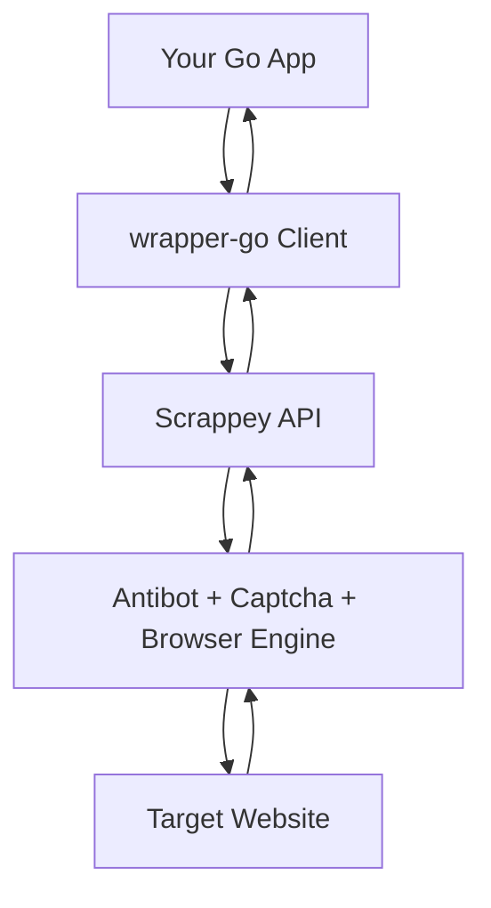

# Scrappey - Official Go Wrapper

Official Go wrapper for the [Scrappey](https://scrappey.com) web scraping API.  
Bypass antibot protections, run browser actions, manage sessions, and scrape with proxy support through a simple Go client.

[](https://opensource.org/licenses/MIT)

## Features

- Cloudflare and antibot bypass support through Scrappey API
- Captcha solving support through Scrappey API
- Session management (`sessions.create`, `sessions.destroy`, `sessions.list`, `sessions.active`)
- All main HTTP commands (`request.get`, `request.post`, `request.put`, `request.delete`, `request.patch`)
- Request mode selection (`browser` and `request`)
- Flexible request payloads with `map[string]any` for full API compatibility
- Configurable base URL and timeout

## Pricing

Scrappey pricing is API-side and shared across wrappers.

| Feature | Scrappey | ZenRows | ScrapingBee | Scrapfly |
|---------|----------|---------|-------------|----------|
| Price per 1K scrapes (JS + residential) | EUR 1 | USD 25 | USD 25 | USD 187 |
| Concurrent requests | 200 | 10 | 5 | 5 |
| Billing model | Pay-as-you-go | Monthly | Monthly | Monthly |

## How It Works



Request flow:

1. Build options in Go (`map[string]any`).
2. Wrapper sends one POST call to Scrappey API with `cmd`.
3. Scrappey handles bypass/captcha/browser/proxy logic.
4. Wrapper returns structured response (`APIResponse`).

## Installation

```bash
go get github.com/scrappey/wrapper-go
```

Requires Go `1.21+`.

## API Key Setup

Set your Scrappey API key with environment variables.

PowerShell:

```powershell
$env:SCRAPPEY_API_KEY="your_api_key_here"
```

Bash/Zsh:

```bash
export SCRAPPEY_API_KEY="your_api_key_here"
```

Or pass directly to `NewClient(...)`.

## Quick Start

```go
package main

import (
	"context"
	"fmt"
	"os"

	scrappey "github.com/scrappey/wrapper-go"
)

func main() {
	client, err := scrappey.NewClient(os.Getenv("SCRAPPEY_API_KEY"), nil)
	if err != nil {
		panic(err)
	}

	res, err := client.Get(context.Background(), scrappey.RequestOptions{
		"url": "https://example.com",
	})
	if err != nil {
		panic(err)
	}

	fmt.Println(res.SolutionInt("statusCode"))
	fmt.Println(res.SolutionString("response"))
}
```

## Request Modes

Scrappey supports two request modes:

| Mode | Description | Typical Use |
|------|-------------|-------------|
| `browser` | Headless browser mode | JS-heavy sites, browser actions, stronger antibot handling |
| `request` | HTTP/TLS request mode | Faster and cheaper API/HTML requests |

Example using `request` mode:

```go
res, err := client.Get(ctx, scrappey.RequestOptions{
	"url":         "https://api.example.com/data",
	"requestType": "request",
})
```

## Session Management

```go
sessionRes, err := client.CreateSession(ctx, scrappey.SessionOptions{
	"proxyCountry": "UnitedStates",
	"premiumProxy": true,
})
if err != nil {
	panic(err)
}

sessionID := sessionRes.Session

_, _ = client.Get(ctx, scrappey.RequestOptions{
	"url":     "https://example.com",
	"session": sessionID,
})

active, _ := client.IsSessionActive(ctx, sessionID)
fmt.Println("active:", active)

_, _ = client.DestroySession(ctx, sessionID)
```

## API Reference

### Constructor

```go
client, err := scrappey.NewClient(apiKey, &scrappey.Config{
	BaseURL: "https://publisher.scrappey.com/api/v1", // optional
	Timeout: 5 * time.Minute,                          // optional
})
```

### Client Methods

| Method | Description |
|--------|-------------|
| `Request(ctx, payload)` | Send raw command payload (`cmd` required) |
| `Get(ctx, options)` | Send `request.get` |
| `Post(ctx, options)` | Send `request.post` |
| `Put(ctx, options)` | Send `request.put` |
| `Delete(ctx, options)` | Send `request.delete` |
| `Patch(ctx, options)` | Send `request.patch` |
| `CreateSession(ctx, options)` | Send `sessions.create` |
| `DestroySession(ctx, sessionID)` | Send `sessions.destroy` |
| `ListSessions(ctx, userID...)` | Send `sessions.list` |
| `IsSessionActive(ctx, sessionID)` | Send `sessions.active` and return bool |
| `CreateWebSocket(ctx, options)` | Send `websocket.create` |

## Response Structure

Main response type: `APIResponse`

- `Data` (`success` or `error`)
- `Error`
- `Session`
- `TimeElapsed`
- `Solution` (`map[string]any`)
- `HTTPStatus`
- `Raw` (full decoded JSON map)

Helpers:

- `SolutionString(key string)`
- `SolutionInt(key string)`

## Error Handling

Error types:

- `AuthenticationError`
- `ConnectionError`
- `TimeoutError`
- `APIError` (base type)

Transport error messages are sanitized to avoid leaking API keys from URLs.

## Examples

Two runnable examples are included:

1. `go run ./examples/basic`
2. `go run ./examples/session`

## Security

- Never commit real API keys.
- Use GitHub Actions secrets for CI/CD.
- `.env` files are gitignored.
- Secret scanning runs in CI (`.github/workflows/secret-scan.yml`).

GitHub Actions example:

```yaml
env:
  SCRAPPEY_API_KEY: ${{ secrets.SCRAPPEY_API_KEY }}
```

More details: [SECURITY.md](./SECURITY.md)

## Links

- Website: [https://scrappey.com](https://scrappey.com)
- App: [https://app.scrappey.com](https://app.scrappey.com)
- Docs: [https://wiki.scrappey.com](https://wiki.scrappey.com)

## License

MIT - see [LICENSE](./LICENSE).

## Disclaimer

Use this software only in compliance with applicable laws, website terms, and privacy regulations.
